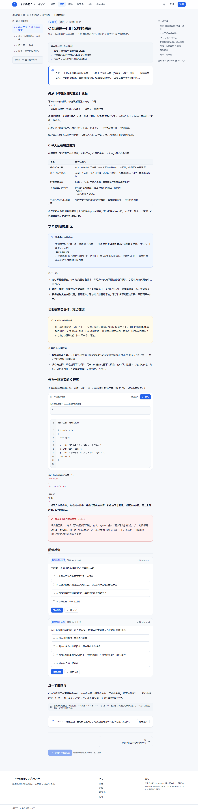
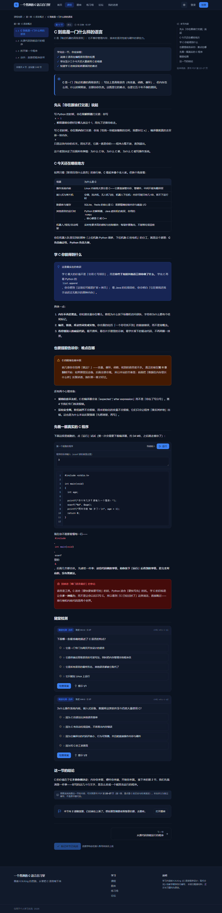
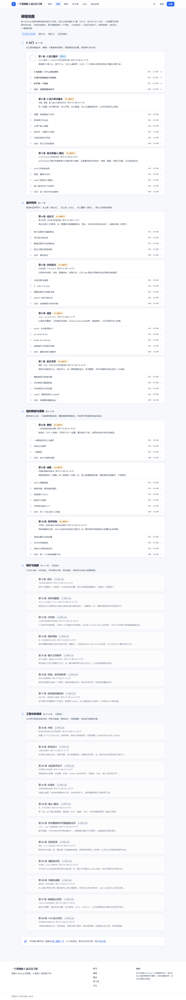
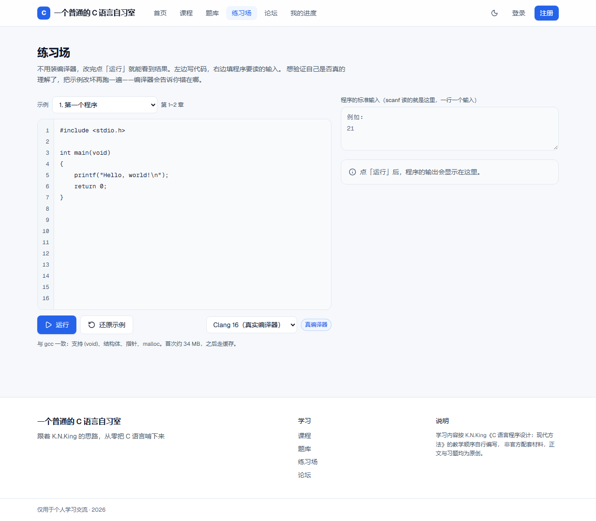

# 一个普通的 C 语言自习室

一个可以在浏览器里**直接编译运行真 C 语言**的自学网站：跟着 K.N.King《C 语言程序设计：现代方法（第 2 版·修订版）》的章节顺序读讲义、写代码、跑测试，学习进度、练习判题、问答社区一条龙。

线上地址：**https://c-study-room.netlify.app**


## 它和别的在线教程有什么不同

- **不是"模拟运行"，是真的编译器。** 代码在浏览器里由 clang 16 编译成 WebAssembly 后执行（`@wasmer/sdk`），`int main(void)`、结构体、`malloc`、`scanf` 都是真的能跑；另有一套 JSCPP 解释器作为轻量兜底引擎。
- **讲义与练习同源。** 49 篇 MDX 讲义 + 按章组织的练习题库，讲义里的代码块可以直接丢进运行器；题库带机器验证的测试用例，判题在本地跑，不依赖服务端沙箱。
- **有进度、有正反馈。** 学习进度、连击、经验值、徽章墙、学习热力图，登录后同步到云端。
- **能提问。** 带采纳答案的论坛，卡住的时候不必孤军奋战。

| 讲义（浅色） | 讲义（深色） | 进度页 |
| --- | --- | --- |
|  |  |  |

| 学习地图 | 练习场 | 移动端 |
| --- | --- | --- |
|  |  |  |

## 技术栈

| 层 | 选型 |
| --- | --- |
| 框架 | Next.js 16.3（App Router）+ React 19 + TypeScript |
| 样式 | Tailwind CSS v4，冷色调（蓝 / 灰）主题，明暗双主题 |
| 内容 | MDX（`@mdx-js/mdx`）+ remark-gfm + rehype-pretty-code / Shiki |
| C 运行器 | clang 16 → WebAssembly（`@wasmer/sdk` 0.16），JSCPP 兜底 |
| 认证 | Auth.js（NextAuth v5 beta）+ bcryptjs |
| 数据库 | Supabase Postgres + Prisma 7（`@prisma/adapter-pg`） |
| 校验 / 测试 | zod、Vitest（单测 + 题库完整性）、Playwright（e2e） |
| 部署 | Netlify（`@netlify/plugin-nextjs`） |

## 本地运行

环境要求：**Node 22.x**（`engines` 里锁了 `>=22 <23`）。

```bash
npm install

# 1) 配置环境变量：复制模板后填入自己的值
cp .env.example .env.local
#    需要 DATABASE_URL / DIRECT_URL（Supabase pooler）、AUTH_SECRET、CRON_SECRET 等
#    数据库搭建细节见 docs/database-setup.md

# 2) 抓取自托管产物（两个都不进版本库，首次必须手动生成）
node scripts/fetch-toolchain.mjs     # → public/toolchain/clang.pkg.gz（约 34MB）
node scripts/vendor-wasmer-sdk.mjs   # → public/wasmer/**（@wasmer/sdk 浏览器运行时）

# 3) 初始化数据库结构
npx prisma migrate deploy

# 4) 起服务
npm run dev        # http://localhost:3000
```

> ⚠️ **两个自托管产物是必需的，不是可选项。**
> `public/toolchain/clang.pkg.gz` 是编译器的字节码包；`public/wasmer/**` 是 SDK 的浏览器端运行时（Turbopack 会漏发 SDK 内部 worker 依赖的 4 个 js 文件，所以必须自己 vendor 一份）。缺任何一个，运行器都会静默 `exit=1` 然后抛 `Scheduler is dead`。
>
> 另外页面必须处于 **COOP/COEP 隔离**环境（`next.config.ts` 里已配好响应头），否则 `SharedArrayBuffer` 不可用，Worker 会被浏览器拦掉。

一键脚本（杀端口 → 构建 → 启动）：

```bash
bash scripts/serve.sh 3000
```

## 目录结构

```
content/                讲义源文件（ch01…ch10，每章若干 .mdx）
src/app/                路由与 Server Actions（learn / exercises / forum / progress / playground）
src/components/         UI 组件（code / learn / exercises / forum / progress / site / ui）
src/content/            课程大纲、题库（exercises/ch01.ts…）、进度状态定义
src/lib/c-runner/       C 运行器：引擎注册、Worker 协议、clang-wasm / JSCPP 两种实现
src/lib/                数据库、MDX 渲染、判题校验、经验值等
prisma/                 schema 与迁移
scripts/                工具链抓取、SDK vendor、部署与环境变量推送、探针脚本
tests/                  Vitest 单测/集成 + Playwright e2e
docs/                   搭建与运维文档（见下）
```

## 文档

| 文档 | 内容 |
| --- | --- |
| `docs/content-pipeline.md` | 讲义与题库的编写规范、构建流程 |
| `docs/exercise-bank.md` | 题库结构与机器验证方式 |
| `docs/runner-spike.md` | 浏览器内跑 C 的选型调研与踩坑记录 |
| `docs/database-setup.md` | Supabase + Prisma 7 接入（pooler、证书、迁移） |
| `docs/auth-setup.md` | Auth.js 配置 |
| `docs/netlify-deploy.md` | Netlify 部署的坑（符号链接、COOP/COEP 响应头、环境变量） |
| `docs/progress-loop.md` | 学习进度与经验值循环 |
| `docs/keepalive.md` | Supabase 保活端点与定时任务 |

## 部署

Netlify 一键：

```bash
netlify deploy --build --prod
```

注意 Netlify 上的三个必踩坑（符号链接 deref、`/_next/static` 与 `/wasmer` 的 COOP/COEP 响应头、环境变量导入静默丢失），细节都写在 `docs/netlify-deploy.md`。

## 许可与致谢

- 课程顺序与知识点编排参考 K.N.King《C 语言程序设计：现代方法（第 2 版·修订版）》，讲义与练习均为本项目原创撰写，仓库内**不包含**该书的任何电子版内容。
- 本项目代码以学习与教学为目的公开，欢迎 fork 改成自己的自习室。
